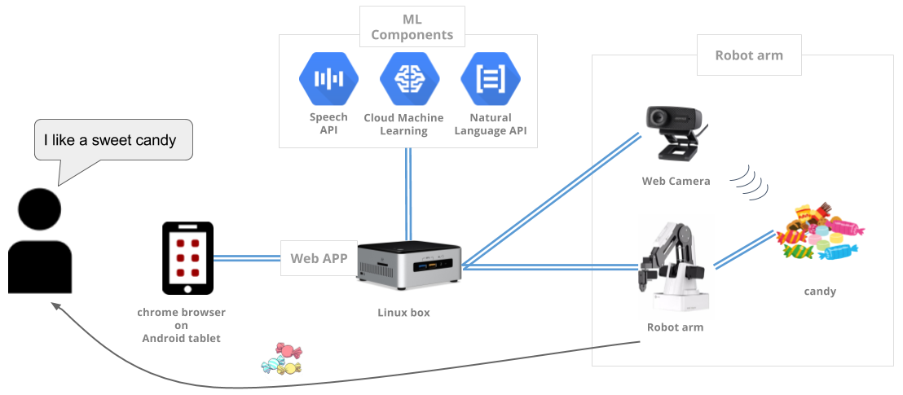

"Find Your Candy with Cloud ML" system diagram

## Understanding your request with ML APIs
The demo starts with listening to your voice request such as "I like a dark chewy chocolate", and analyzes it with Cloud Speech API. The API converts audio data into text with Google's high quality voice recognition technology. Then the text is processed with Cloud Natural Language API and its syntactic analysis so that the system can extract what are the important verbs, adjectives and nouns in the text to understand the meaning of your command.

Then the system uses word2vec and regression (Inception-v3 + transfer learning) on Cloud Machine Learning (Cloud ML) for choosing the best candy for your request. The algorithm is smart enough to understand the similarity of meaning between two words - such as "milky and creamy", "hot and spicy" - based on an analysis result on natural languages. With this technology, the system tries to recommend a candy that has the highest likelihood of fulfilling the request.

## Locating and serving a candy with image recognition on Cloud ML
Once system determined what type of candy to serve, it runs a deep learning model for image recognition and analyzes the image of candies on the table. The model locates the position of the target candy and serve it to you with the robot arm.

In the training mode, the system uses Inception model with transfer learning on Cloud ML to train the model within a couple of minutes by utilizing the computation power of Google Cloud. So you can bring any objects you like and train the system on-the-fly at high accuracy. It's not designed only for picking up the candies, but for a versatile image recognition for wide variety of applications.

## Serving mode
- Android tablet: for UI, recognizes the voice command with Speech and NL API
- Controller PC (Linux) and camera: recognizes the candies with Cloud ML, controls the robot arm
- Robot arm: picks the candy, takes it to the certain location, and drops.

## Learning mode
- Android tablet: shows UI for training process updates
- Controller PC: runs Inception-v3 + transfer learning on Cloud ML to train a model from scratch, with the camera image

## Setting things up
- Prepare [hardware components](./setup/requirements.md)
- Prepare [candies](./setup/candidate_candies.md)
- Set up as directed by [setup/README.md](./setup/README.md)

## Note
- Currently, the system is not using Cloud Speech API. It uses Web Speech API that shares the same voice recognition backend.
- For Learning mode it is using Cloud ML training. For Serving mode it is not using Cloud ML prediction.
