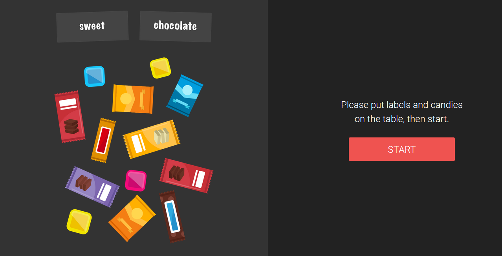
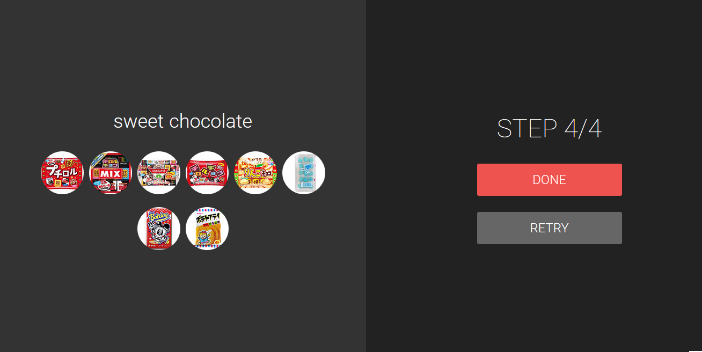
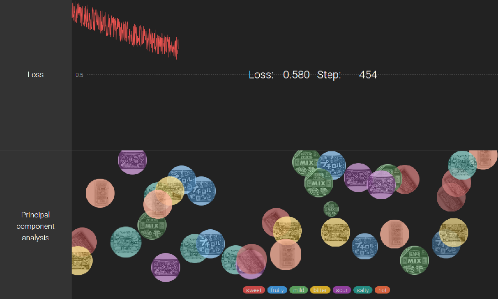
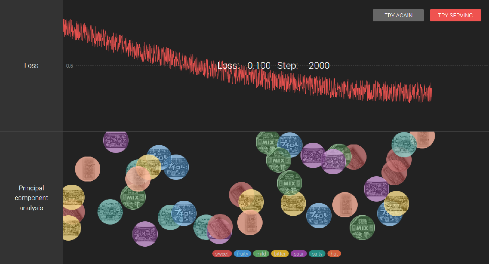
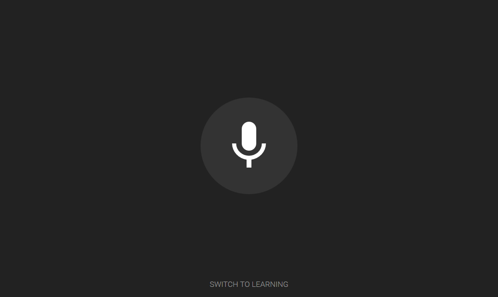

## Overview
There are two modes in this demo, learning mode and serving mode.
In learning mode, you give labels to candies and let them learn. This will let AI learn the relationship between label and candies.
In Serving mode, the whole system takes advantage of the learning result and serves sweets according to the user's taste.

## Learning Mode
- Prepare labels that describe candies.
- Perform camera shooting and label matching for 4 times.

1. Place the candies you want AI to learn on the A3 marker paper. At this time, open the space between candies, and arrange so that sweets do not hide the marker frame from camera.
2. Write labels for the candies on post-it. Place them above the line of the A3 paper with associated candies placed on the oposite side of the line.

3. Push 'Start' button, and let the system learn the relations.

4. Repeat the previous steps(2to3)  to make 4 sets of releations.

5. Push 'Done' button, then learing will soon take place.

6. Wait for about one minutes until it finishes up learning.

7. When learning is successful, you may proceed by pressing 'TRY SERVING' button.

## Serving Mode
- In Serving mode, place candies only on the fan-shaped part of the A3 marker paper. The grayed-out area represents unreachable range of the robot arm.
- Please keep in mind that placing sweets in a position beyond the range will not work properly.

1. Press the microphone mark in center of the screen to start recording of your preference of the candies. ( You need to speek it in a short phrase. )

2. Based on learned information, AI recommends a candy that matched the utterance most among the other candies on the table.
3. The robot arm picks up the chosen candy, takes it to the certain location, and drops.
