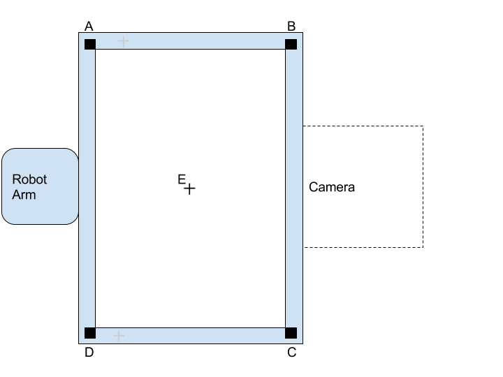
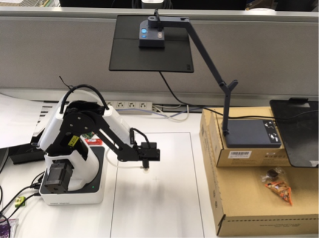
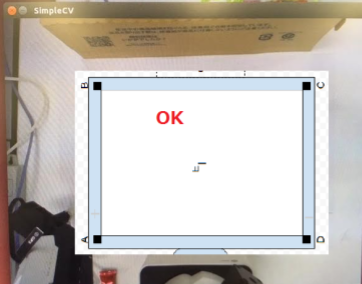
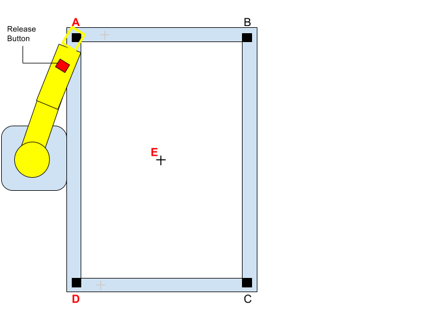

setup
=====

### Space Requirement
- More than 500mm x 550mm ( recommend 80cmｘ80cm )  space required.

### Hardware Components
- Robot Arm
  - [Dobot Magician](http://dobot.cc/store/buy-dobot-magician.html)
- Document camera
  - [Ipevo Ziggi-HD](https://www.amazon.com/dp/B01530XGMA)
  - [Ipevo Height Extension Stand](https://www.amazon.com/dp/B00CTIF2O0)
- [A3 marker sheet](./image/marker_paper.pdf)
  - for camera and robot arm to adjust their position
- Linux Box
  - [Intel NUC kit](https://www.amazon.com/dp/B01DG1SEES)
    - Core-i3 or i5 (included in Intel NUC kit)
    - HDMI or mini HDMI cable is needed accordingly.
  - 2 x [8GB Memory](https://www.amazon.com/dp/B00CQ35HBQ))
  - [SSD 250GB](https://www.amazon.com/dp/B0194MV5U8)（One of Sandisk’s long life (5 yrs) series is strongly recommended for price and stability. not samsung or other）


### Step1 : Place hardware components and Marker sheet
1. Print out [the marker sheet](./image/marker_paper.pdf) in A3 paper and stick it on the center
(This sheet will be used during both setup and demo.)
2. Build the robot arm by following manuals.
3. Place the robot arm to attach the A3 paper on A-D side.
4. Plugin the power supply unit of the robot arm to AC outlet.
5. Place the camera(CDVU-06IP) as shown below. In this case, camera should built with joint extender, CDVU-04IP-A1.
Note: due to unavailability of CDVU-06IP extender unit.




### Step2 : Setup Linux box as controller PC.
- Build your linux box by following direction of each manufacture.
  - You might need to mount ssd and memory inside the linux box unless they are already built in.
- Connect both the robot arm and the camera to linux box.
  - The suction cup should be attached on arm end.
- Connect to the internet using LAN cable.
- During setup you need  a LCD display, a keyboard and a mouse. please prepare.
- Install linux and softwares
  - Ubuntu 16.04.1 Server 64bit (you may also try Desktop 64bit)
    - See [linux box.md](./linux_box.md)

### Step3: Camera Calibation
The following instructions illustrates how to adjust the camera position.

1. Boot up linux box and login the desktop.
2. Execute [(cd script ; python2 camera_tune.py)](./script/camera_tune.py) that are included in DEMO software. And see the camera view in the window.
3. If you cannot see OK sign in the window, tweak the camera or its extension and have whole image of A3 paper.
  - You may also try to get better focus by switching between S and C on the camera.
4. You may click on left mouse button to exit this software.



### Step4: Robot Arm Caribration
(* Read the safety manuals of your Robot Arm , befor proceeding this section.)
1. Execute [(cd script ; python2 robot_tune.py)](./script/robot_tune.py) to start tuning the coordinate of arm.
2. Hit `Enter` key. to initialize the robot arm.
3. Push the `release button` (which has symbol of `unlock` ) while you holding the robot arm by the other hand. Please be aware when the button is pressed, the robot arm looses friction and will start falling instantly. To avoid damaging your robot or desk, you should always assist robot arm when you press `release button`.
4. Slowly land the arm edge to the center of `Maker A`. (still pressing the button.)
5. Hit `Enter` key.
6. Repeat above process for 3,4 and 5 for Marker D and E.
7. The program ends automatically.



### Step5: Tablet
1. Bootup Nexus9 and login with a google account for demo.
2. Update firmware
3. Connect 'GL0402' (Ultra Adapter) to Nexus9’s OTG connector.
(When you buy ChromeCast Ultra, it comes with one 'GL0402'. So you need extra ChromeCast Ultra to just get a 'GL0402' for Nexus9.)
4. Follow the “Set up Chromecast” on the [google support page](
https://support.google.com/chromecast/answer/2998456?hl=en)
\(there is instruction for Android 4.1 and higher\).
(* If you have trouble with voice recognition of Nexus9, consider for external microphone.)

### Step6: Demo Application
1. GCP for API service
This demo is based on GCP. Create a credential associated to your project.
(see https://console.developers.google.com/apis/ )
```
$ export GOOGLE_APPLICATION_CREDENTIALS="path_to_your_own_credential_file"
```
2. Configure and run demo
  - See [README.md](../robot-arm) for robot-arm
  - See [README.md](../webapp) for webapp
