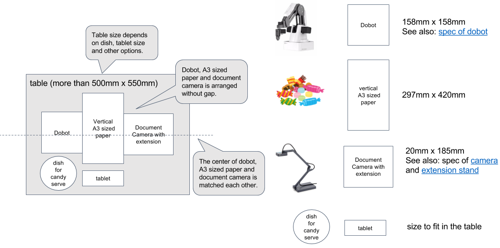
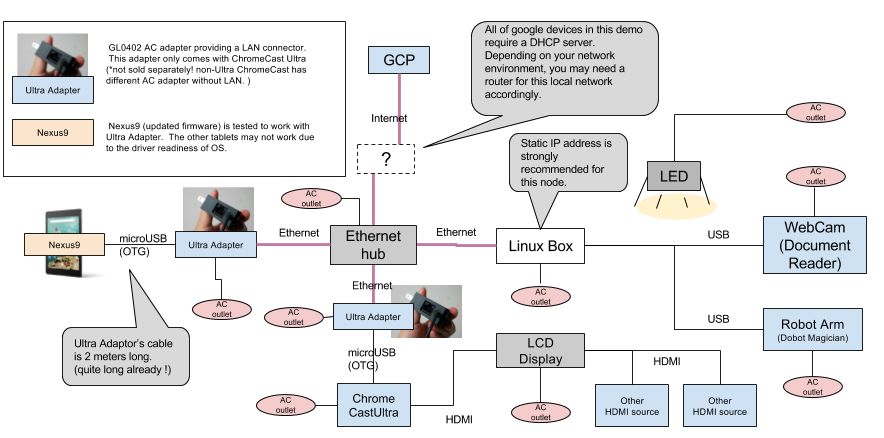

Installation requirements
===

## Installation Requirements
### Space requirement

- Table Space: 500mm x 550mm (800mm x 800mm recommended)
  - Dobot: [physical Spec of Dobot](http://dobot.cc/dobot-magician/specification.html)
  - Document Reader: [physical Spec of Camera and Extension](https://www.amazon.com/dp/B01530XGMA)
  - Nexus 9: [physical Spec of Nexus 9](http://www.htc.com/us/tablets/nexus-9/)
  - A3: The marker sheet should be printed in good quality and sticked to the center of table.

### Lighting Requirement
- Environmental Lighting
  - Bright enough to detect markers.
  - No shadow over A3 paper.
- LED light (optional)
  - Dimmerable LED light: [MOSPRO Cordless Clip Desk Lamp] (https://www.amazon.com/dp/B0192XSVYM/)

### Network and AC outlet requirements

- 4 x AC Outlets for each robot (total 12 outlets)
  - Robot Arm
  - Document Camera
  - Controller PC
  - Ethernet adapter for Nexus 9
- 4 x AC Outlets for the large HDMI display
  - HDMI Display
  - Ethernet hub
  - Chromecast Ultra USB power
  - Ethernet adapter for Chromecast
  - Network connection
- 1 x wired Ethernet connection
  - DHCP server
  - IP reachability between PC and robot
  - Internet access (to GCP, github, etc..)
