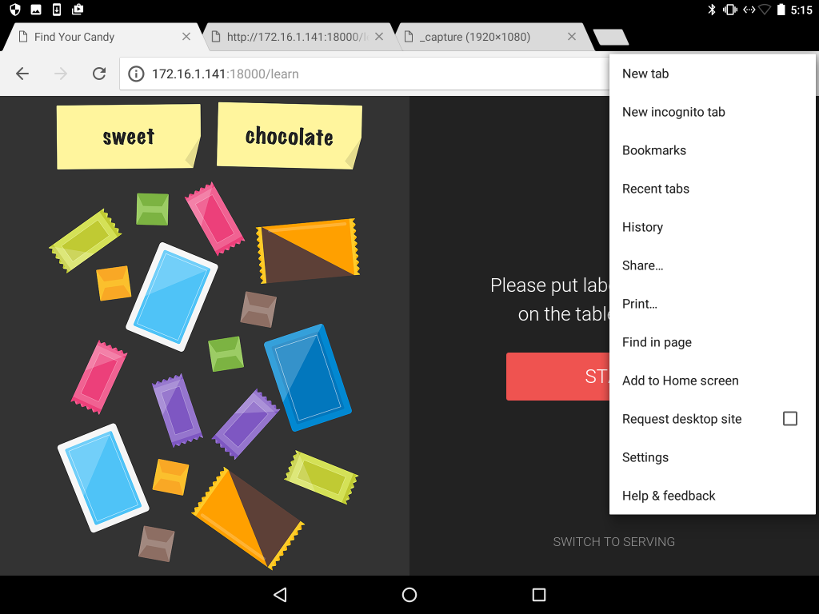
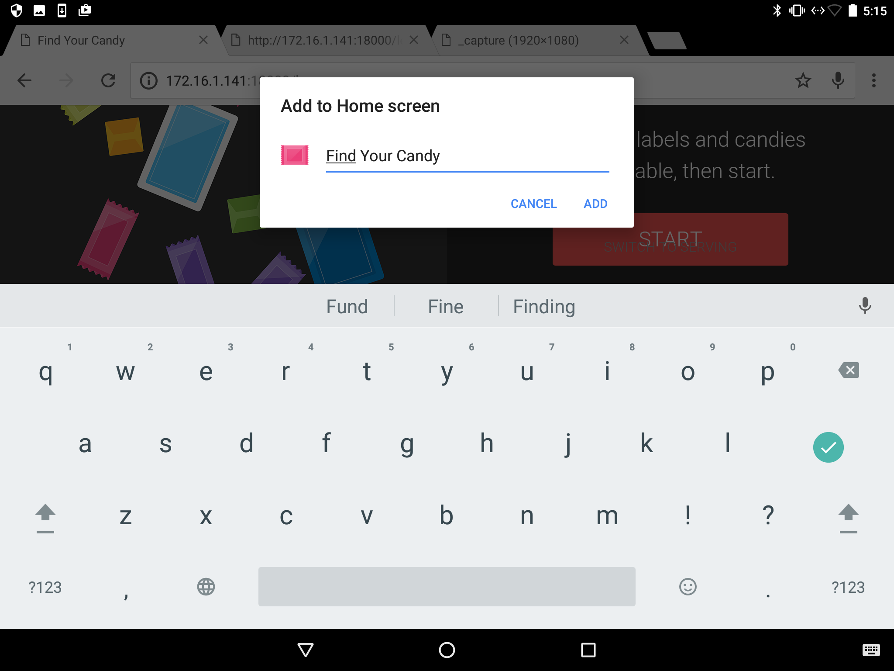
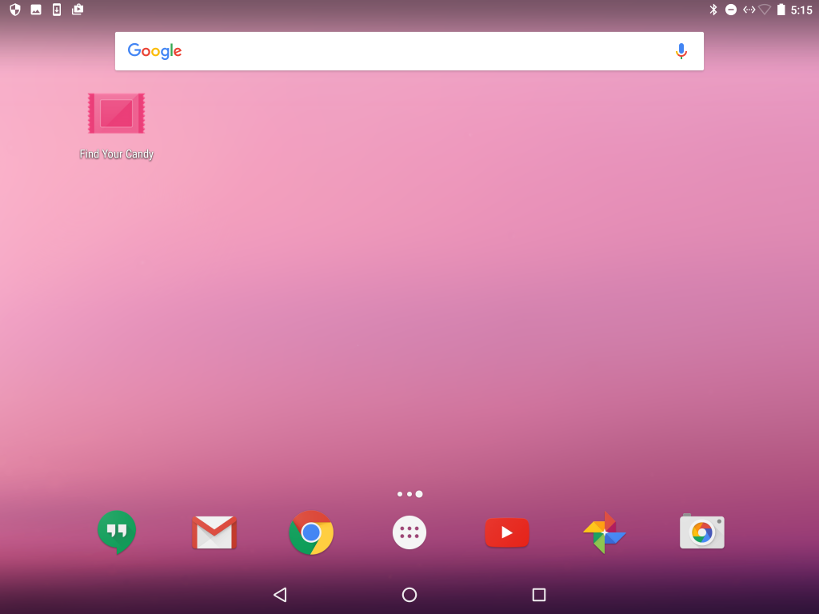
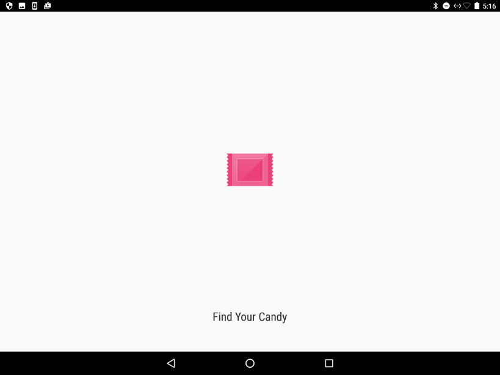
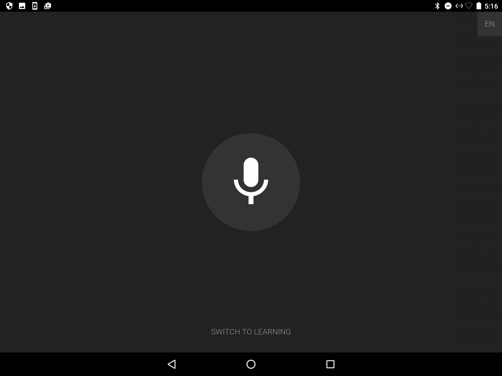

Copyright 2017 BrainPad Inc. All Rights Reserved.
webapp
===

## Note
This software is design to work with Python2.7 under following condtion.
- This software depends on the following libraries:
  - OpenCV3.2 (need to be compiled from source.)
  - Refer to installation_instructions.md for installation.
  - Softwares you install by pip
  ```
  $ pip install -r requirements.txt
  # ex)
  #  - TensorFlow
  #  - Flask
  #  - uWSGI
  #  - google-cloud
  #  - scipy
  #  - gemsim
  #  ...
  ```


### Environment variables
```
export FLASK_ENV='prd'   # choices are 'prd', 'stg' or 'dev'
export GOOGLE_APPLICATION_CREDENTIALS="path_to_your_own_credential_file"
export PYTHONPATH=/usr/local/lib/python2.7/dist-packages
```

### word2vec
- download word2vec model from https://github.com/mmihaltz/word2vec-GoogleNews-vectors
- copy it to the 'models' directory
```
$ mkdir -p ~/FindYourCandy/webapp/candysorter/resources/models
```

### inception-V3
- download inception-v3 model from http://download.tensorflow.org/models/image/imagenet/inception-2015-12-05.tgz
- copy it to the 'models' directory
```
$ mkdir -p ~/FindYourCandy/webapp/candysorter/resources/models
$ cd ~/FindYourCandy/webapp/candysorter/resources/models
$ tar xvzf inception-2015-12-05.tgz classify_image_graph_def.pb
```

### CloudML
#### create your own bucket for CloudML
- [create your own bucket](https://cloud.google.com/storage/docs/creating-buckets) in your project
- replace some environments in `webapp/candysorter/config.py`

```
# replace "YOUR-OWN-BUCKET-NAME" to your own bucket name
CLOUD_ML_BUCKET        = 'gs://{YOUR-OWN-BUCKET-NAME}'
CLOUD_ML_PACKAGE_URIS  = ['gs://{YOUR-OWN-BUCKET-NAME}/package/trainer-0.0.0.tar.gz']
CLOUD_ML_PYTHON_MODULE = 'trainer.train'
CLOUD_ML_TRAIN_DIR     = 'gs://{YOUR-OWN-BUCKET-NAME}/{job_id}/checkpoints'
CLOUD_ML_LOG_DIR       = 'gs://{YOUR-OWN-BUCKET-NAME}/logs/{job_id}'
CLOUD_ML_DATA_DIR      = 'gs://{YOUR-OWN-BUCKET-NAME}/{job_id}/features'
```
( https://github.com/BrainPad/FindYourCandy/blob/master/webapp/candysorter/config.py#L60-L65 )

#### build and upload package to GCS
- execute shell for build and upload package
```
# replace {YOUR-OWN-BUCKET-NAME} to your own bukcet name
$ bash build_package.sh gs://{YOUR-OWN-BUCKET-NAME}/package
```

### Configuration files
- `candysorter/config.py`
  - WORD2VEC_MODEL_FILE="path_to_GoogleNews-vectors-negative300.bin.gz"
     default path:
       candysorter/resources/models/GoogleNews-vectors-negative300.bin.gz

### Network
- TCP port 18000 need to be exposed to browser.

## Run app
After tuning the camera, you can start webapp.
```
$ sudo systemctl start uwsgi-webapp.service
```
In this setup senario, the next command is not used. We use nginx+uWSGI instead.
```
# Run app. This requres environment variables.
$ python2 run.py  # Be sure to use python2.7
```

## UI
- Acceess http://{LINUX_BOX_IP}:18000/predict by chrome browser after app launched
- We provide "Full Screen Mode". Please setup following instruction.

#### setup for Full Screen Mode
- open setup menu and tap "Add to Home screen"


- name to icon on Home screen


- tap icon





## API example
##### Morphological Analysis
```sh
$ curl -i -H "Content-type: application/json" -X POST http://{LINUX_BOX_IP}:18000/api/morphs \
    -d '{"text": "I like chewy chocolate candy", "id": "test"}'
```

##### Similarities

```sh
$ curl -i -H "Content-type: application/json" -X POST http://{LINUX_BOX_IP}:18000/api/similarities \
    -d '{"text": "I like chewy chocolate candy", "id": "testid"}'
```

##### Reset the model for the relation of labels and candies
If you keep teaching labels to the systen, at some point you want to clear all them out.
```sh
$ curl -i -H "Content-type: application/json" -X POST http://{LINUX_BOX_IP}:18000/api/_reset \
    -d '{"id": "testid"}'
```
